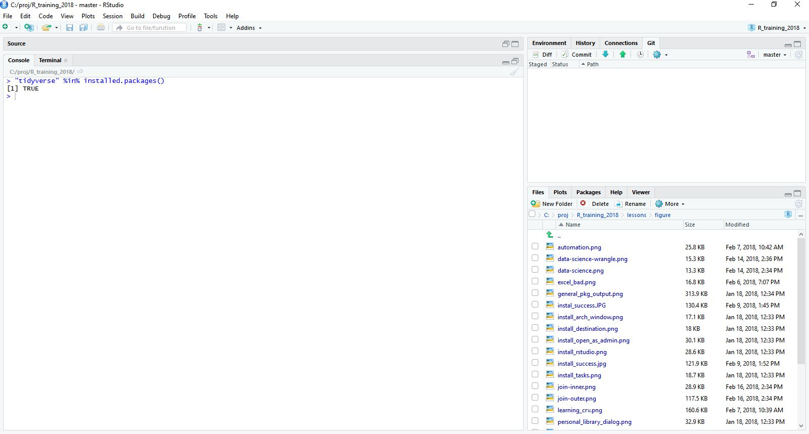

# Set Up

Thanks for your interest in learning R.  For the workshop, we will be using [RStudio](https://www.rstudio.com/) as our interface to R.  In order to participate in this workshop you will need to make sure you have R and RStudio installed on your laptop.

Big thanks to the [USGS-R Training group](https://owi.usgs.gov/R/training.html) for making their installation materials available.  The instructions below are mostly theirs with some light editing and should help you get all set up for the workshop.

# Install R and RStudio
These instructions are for Windows install. Download and install R for Mac [here](https://cran.r-project.org/bin/macosx/). 

## Download and install R
Go to [CRAN and download](https://cran.rstudio.com/bin/windows/base/) the R installer for Windows. Make sure to choose the latest stable version (v3.4.3 as of January 2018).

Once the installer downloads, Right-click on it and select "Run as administrator". 

Type in your credentials and click yes (or if you don't have administrator access have your IT rep install with Admin privileges).


You can click next through the standard dialogs and accept most defaults. But at the destination
screen, please verify that it is installing it to C:\Program Files\R (version number may vary)


At the "Select Components" screen, you can accept the default and install both 32-bit and 64-bit versions.


At this screen, uncheck 'Create a desktop icon' because non-admin users in Windows will be unable to delete it.


## Download and install RStudio
[](https://www.rstudio.com/products/rstudio/download/)

Double-click the installer. It will ask for your administrator credentials to install (you might need to have your IT rep install again). 

Accept all the default options for the RStudio install.


# Check Install

## Open RStudio
Once installed, RStudio should be accessible from the start menu.  Start up RStudio.  Once running it should look something like:


## Find "Console" window
By default the console window will be on the left side of RStudio.  Find that window.  It will looking something like:  


## Copy and paste the code
Click in the window and paste in the code from below:


```r
version$version.string
```

## Verify your installed R version
Ideally you should be running the latest stable release (v3.4.3 as of January 2017). If you have an older version, please install the newest version using the instructions above.

Here is what my R version looks like.

```
## [1] "R version 3.4.3 (2017-11-30)"
```

# Add packages

Install packages available for all R users from [CRAN](https://cran.r-project.org/) by pasting the following code and hitting `ENTER`.


```r
install.packages("tidyverse")
```

If you see 


That's OK! There’s a dialog box hiding behind RStudio asking if you want to create a personal folder in your Documents folder.  Click *Yes*. It will look something like this when done:


# Grab the sample datasets

We'll be working with a chemistry dataset and metadata from the Bight for many of our examples. Please download the chemistry dataset [here](http://bit.ly/2Gpgzil) and the metadata [here](http://bit.ly/2sCBtbV).  Make sure you have access to these data on the day of training.

# Exercise 1
Just to make sure everything is working do the following:

1. Open up RStudio.
2. Find the "Console."  This is usually the left part RStudio.
3. In the "Console", find the R Prompt.
4. Type in (copy and paste from here will also work) the following commands at the R Prompt and hit return.  


```r
"tidyverse" %in% installed.packages()
```

The end result should look something like:




